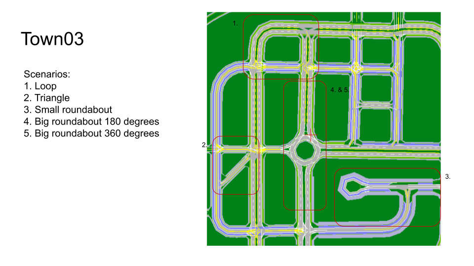

This folder contains pre-defined CARLA data collection configurations with different routes in the example Town03 map.

__urban.yaml__ is the one used for the urban scenario in the thesis. __right_turn.yaml__ is a right turn route in the urban map. To get a sense of other routes, check this: 

