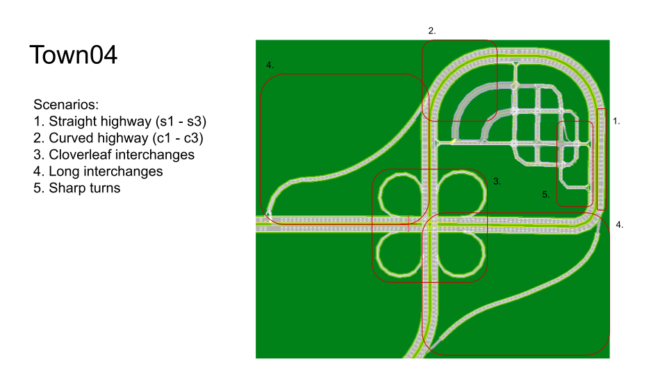

This folder contains pre-defined CARLA data collection configurations with different routes in the example Town04 map.

__highway.yaml__ is the one used for the highway scenario in the thesis. To get a sense of other routes, check this: 

